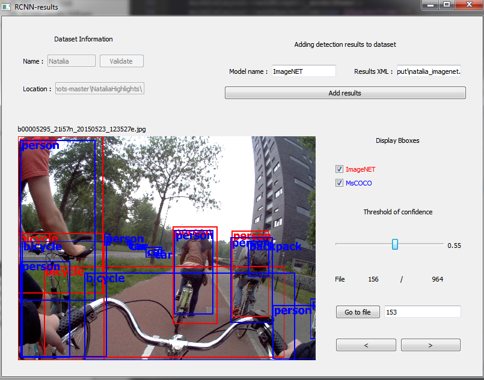
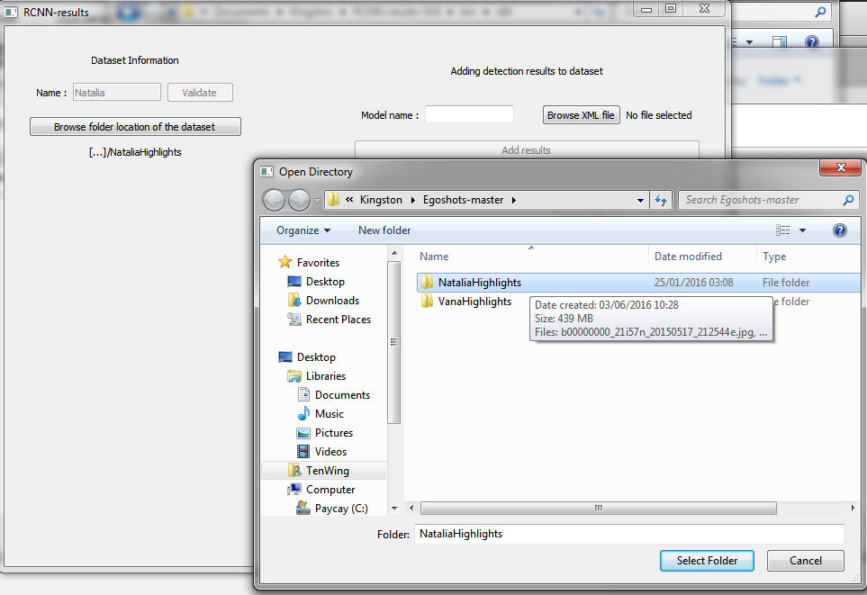
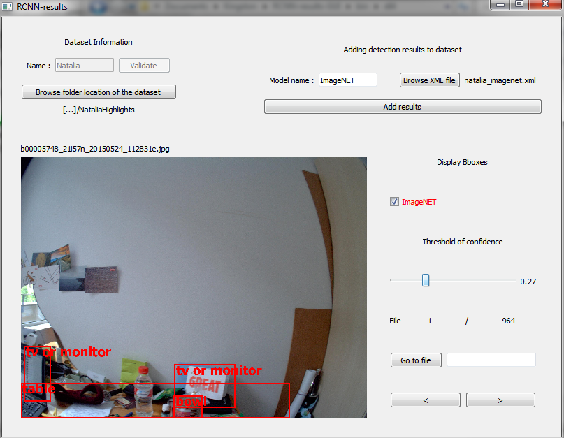

# RCNN-results-GUI 

 

GUI to show results of detection using py-faster-rcnn on pictures, the results must have been converted to XML format

The project is currently in a : "work in progress" status, I'm woriking on it to make the GUI more user friendly

## Project information
This project was made using QT 5.6 On Windows (Should work on Ubuntu too, not tested)

The XML parsing was done using the TinyXML2 library [TinyXML2 website](http://www.grinninglizard.com/tinyxml2/)

The XML format should be formatted using this tool [XML-detection-parser](https://github.com/TenWing/XML-detect-parser)

## Installation / Running
You must have QT 5.6 installed to build the project

You **DON'T** need to install TinyXML2 (code included in the project)

Open the .pro file then just build the project and run it (Ctrl + B / Ctrl + R)

## Tutorial

### Step 1

### Step 2

### Step 3

You can now play with the threshold to filter the objects detected

You can also compare the results of two different RCNN models

To add new RCNN results to compare, just re-do step 2 !
